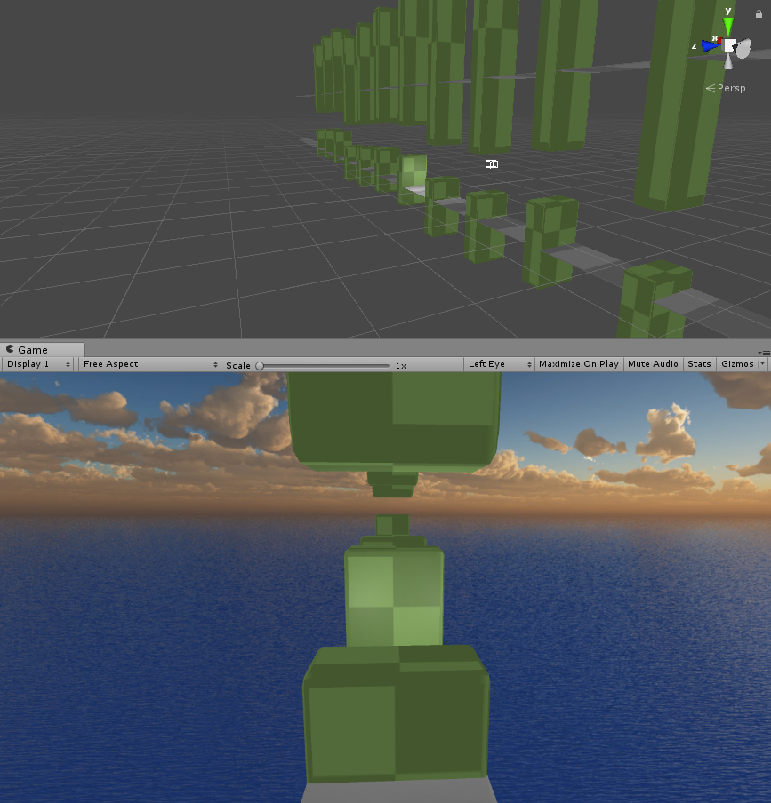
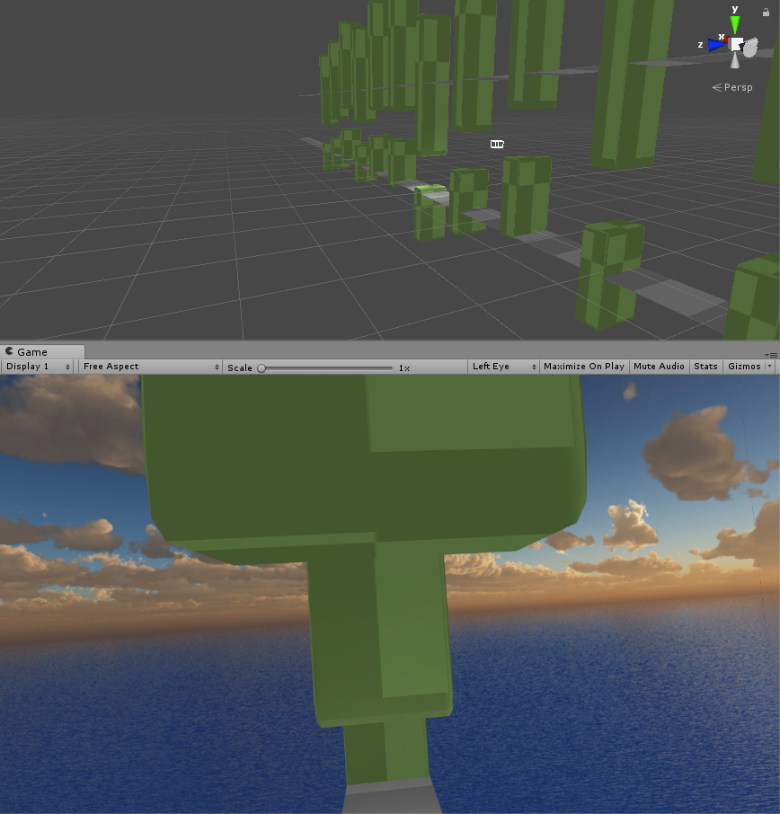

# clappy-bird-vr
Clappy Bird VR - without clapping.

As a coding challenge, we ([@johannesheesterman](https://github.com/johannesheesterman)) decided to make a Flappy Bird version in VR. The idea was to jump by clapping.

## Microphone

We didn't get the microphone to work because fuck Unity.

## Controls

You can move up by pulling the `Right/Left Trigger`. Do note that it is not the prettiest code.

## Code

Unity creates a big project, [here you can find the code](https://github.com/darkeclipz/clappy-bird-vr/tree/master/Assets/Scripts).

## Screenshots

